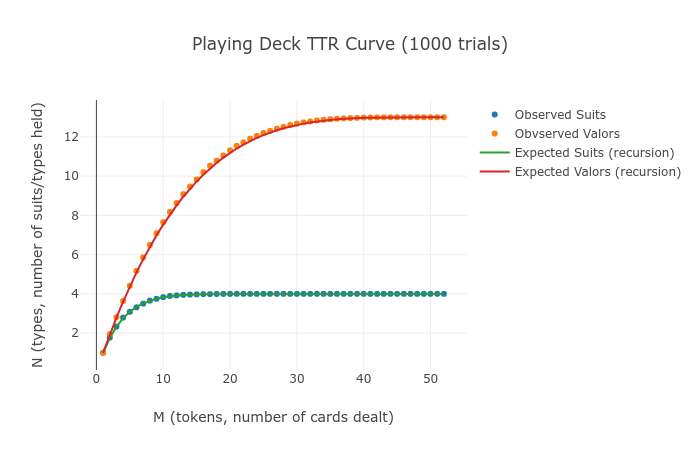
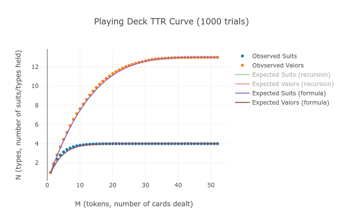

# A New Heap's Law

## Victor Davis

### Abstract

Heap's Law roughly approximates the expected number of types as a function of tokens in a text corpus. Here we derive a new formula from first principles using combinatorics and calculus and prove its accuracy on real text. The result is a logarithmic growth curve parametrized by modeling the corpus as a subset of a larger "meta-book" with a perfect Zipf's Law word frequency distribution. From this we derive an equally predictive estimate of hapaxes and higher n-legomena.

### Background

Consider the following fun little exercise in probability: In a shuffled deck of $52$ cards, $4$ suits of $13$ valors, what is the expected wait time to be dealt at least one of each valor/suit? The answer, which can be gotten a [number of different ways](https://math.stackexchange.com/questions/268432/expected-number-of-card-draws-to-get-all-4-suits), is: $\approx 28$ cards to hold all valors, $\approx 7.66$ cards to hold all suits. But what if we seek a *function* $E(n)$ for the expected number of valors drawn by card $n$? This function should increase smoothly from $E(0)=0, E(1)=1$ to $E(49)=13, E(52)=13$ (by the $49$th draw only three cards remain, guaranteeing saturation). This function should start off steep, then grow shallower as the chances of a *new* valor drops in proportion to the number of cards already held.

This is a card-trick example of a type-token relation: a deck of cards consists of $M=52$ tokens of $N=13$ types with uniform distribution, and we seek a general formula describing how $N$ grows as a function of $M$. To solve this broader question, consider an example: On the $10$th draw suppose you hold $8$ valors. What is the probability the $11$th draw will be a repeat valor vs a new one? Well, because we hold $8$ valors, there are $32$ cards with the same valor as the ones held. $10$ are held, leaving $22$ in the deck of $42$ remaining cards. So the probability of drawing a *repeat* valor is $22/42$ vs a $20/42$ chance of drawing a *new* one. Given $n$ draws, having seen $v$ valors, this gives:

$$P(repeat) = \frac{4v-n}{52-n}$$, $$P(new) = \frac{52-4v}{52-n}$$ [1]

But $v$ was just an observed value. The probability that the $(n+1)$th draw is new can be derived from the *expected* value of the *nth* draw like so (for $s$ repeats of $k$ types, in this case, $s=4$ repeats of $k=13$ valors):

$$P(new) = \frac{ks - sE(n)}{ks-n}$$ [2]

Since the expected value of distinct valors drawn by the $(n+1)$th draw is just the expected value of distinct valors drawn by the $n$th draw plus the probability of seeing a new one on the $(n+1)$th, we have the following recursion:

$$E(n+1) = E(n) + \frac{ks - sE(n)}{ks-n}$$, $$E(0) = 0$$, $$E(1) = 1$$ [3]

Recursing, this gives the sequence $1.00, 1.96, 2.86, 3.71, 4.50, ..., 13$. Notice that the last four values of the sequence are all $N=k=13$, which squares with our intuition that by the $49$th draw we've seen every valor. Also, the denominator goes to zero once $n$ reaches $M=ks=52$, so the recursion naturally stops (there are no more cards to draw). This sequence agrees with experimental results nearly perfectly.

Recursive formulas are ugly. It would be much nicer to find a formula for $E(n)$ as a function of $n$ alone. Here we use calculus to derive such a formula. Notice that since $E(n)$ is monotonically increasing, $$\frac{dE}{dn} \approx \frac{E(n+1)-E(n)}{n+1-n}$$. So, we can rewrite [2] and integrate:

$$dE \approx \frac{ks - sE}{ks-n} dn \to \int \frac{dE}{ks - sE} \approx \int \frac{dn}{ks-n} \to -ln(k-E) \approx -s\ln(ks-n)+C$$ 

$$E(n) \approx k - C'(ks-n)^s$$

Using $E(0)=0$ as a boundary condition, we find $$C' = \frac{k}{(ks)^s}$$, giving:

$$E(n) \approx k - k\bigg(1-\frac{n}{ks}\bigg)^s$$ [4]

$$Valors(n) \approx 4 - 4\bigg(1-\frac{n}{52}\bigg)^{13}$$ [4a]

$$Suits(n) \approx 13 - 13\bigg(1-\frac{n}{52}\bigg)^4$$ [4b]

Plotting, we find a near-perfect match between the discrete values found by recursing and the continuous values given by [4]. Near perfect because the discrete case (actual reality) effectively stopped the integral limit approaching zero once $dn=1$. Thus, [4] is in a sense "too" accurate, smoothing out the discontinuities found in a real deck of cards. Notice that $E(49) = 12.9999$, not what we logically know to actually be $13$.

(All code for above in `carddeck.py` in Appendix 1)

### Types & Tokens in Text Corpora

The above exercise is useful for a *uniform* frequency distribution of types within a corpus of tokens, and lays the groundwork for a harder question: While reading a text corpus of length $M$, how many distinct words $N$ will be encountered by the $n$th word? To clarify, "tokens" refers to "words" and "types" refers to "distinct words." In human languages, the word frequency distribution of a text corpus is anything but uniform. We'll circle around to Zipf's Law later, but for now, let's look at real data and focus on the goal of taking an arbitrary word frequency distribution as input and generating a type-token relation curve as output. Here is a table giving the number of distinct words $N$ seen my the $M$th word in Moby Dick.

## Terminology

**tokens**: instances of typed entities, in our case words of a text corpus

**types**: classifications of tokens, in our case the *distinct* words of a text corpus

**hapax**: a word that appears only once in a corpus

**dis, tris, tetrakis, or n-legomena**: words that appear $2,3,4,n$ times in a corpus

TODO: code accuracy & false words like "ahoy--matey"

TODO: show all three methods in table

| tokens | types |
| ------ | ----- |
| 10000  | 3063  |
| 20000  | 4833  |
| 30000  | 6305  |
| 40000  | 7538  |
| 50000  | 8766  |
| 60000  | 9968  |
| 70000  | 11021 |
| 80000  | 11834 |
| 90000  | 12749 |
| 100000 | 13502 |
| 110000 | 14143 |
| 120000 | 14837 |
| 130000 | 15437 |
| 140000 | 16174 |
| 150000 | 16865 |
| 160000 | 17542 |
| 170000 | 18133 |
| 179402 | 18652 |

We seek to find a formula accurately plotting the above. According to [Heap's Law](https://en.wikipedia.org/wiki/Heaps%27_law), this graph can be approximated by $$E(n) \approx Kn^\beta$$ for some constants $$K,\beta$$. Attempting to fit this curve easily demonstrates that $$\beta$$ must be increasing, giving $$E(n) \approx Kn^{\beta(n)}$$ for some monotonically increasing function $$\beta$$. Bernhardsson et al [TODO: ref] have shown that $$\beta(n)$$ grows as $$\frac{1}{u\ln(n)+v}$$ for free parameters $$u,v$$ that can be correlated among authors (same author, same $$\beta$$, different authors, different $$\beta$$'s). This produces a better fit, but by scrapping Heap's Law and starting from first principles below, we demonstrate an even better one, and extend it to include hapaxes and n-legomena. Bernhardsson et al [TODO: ref] give the analogy that each author carries around in his/her head a "meta-book" from which they draw a stream of words to pen an actual book. This "meta-book" is really just a euphemism for the word frequency distribution characteristic of the author's writing. I.e., the size of his/her vocabulary and the ranked probabilities of choosing each word.

TODO: Fit & plot Bernhardsson

In Moby Dick, a $179402$-word book, Melville uses $18652$ *distinct* words to tell his story. Consider the following table, listing those words in order along with their frequencies and probabilities. (Truncated, of course.) As an aside, notice there are a few entries that can only questionably be called "words." The "word" <stop> refers to a period at the end of a sentence; the "word" <para> refers to a new paragraph. What about "devious-cruising"? Doesn't that count as *two* words? And why count "liberated," "liberating," and "liberate" separately? These questions can get arcane quickly, going to the heart of "what is a word" anyway? The response is twofold. (1) It doesn't really matter how you choose to define a word, or even if there are mistakes in the tabulation [TODO: verify]. The type-token curve is going to be noisy anyway, and the underlying signal is still rooted in combinatorics. (2) Our goal is to take the word frequency distribution as an *input*, apply some formula to it, and arrive at a type-token curve as our *output*. As such, as long as the two tables presented so far rely on the same underlying "bag of words" the relation between them, the *heuristic* mapping the WFD to the TTR-curve will be valid.

The caveat is simply that the actual data observed is heavily dependent on methodology, so I've included all my code in `main.py` in Appendix 2. But the signal in the noise is the same, albeit with different choices of free parameters.

Another caveat: There are three methods one may use to sample text. The most straightforward is to take the first $M$ words. The second is to take a contiguous block of $M$ words from a random part of the corpus. The third is to take $M$ random words from the entire corpus in no preferred order. Believe it or not, all three methods yield more or less the same results. In our study, we use method #3 because the resulting data is least noisy. It's like shuffling the deck before drawing. This completely eliminates any argument that authors' intent, word choice, grammar, or plot development has anything to do with the type-token relation and is purely a statistical phenomenon.

#### Table 1: Word Frequency Distribution of Moby Dick

| word             | RANK  | FREQUENCY |
| ---------------- | ----- | --------- |
| the              | 1     | 12186     |
| <stop>           | 2     | 5962      |
| of               | 3     | 5685      |
| and              | 4     | 5170      |
| a                | 5     | 3739      |
| to               | 6     | 3682      |
| in               | 7     | 3537      |
| that             | 8     | 2311      |
| his              | 9     | 2090      |
| <para>           | 10    | 1981      |
| suction          | 18643 | 1         |
| button-like      | 18644 | 1         |
| ixion            | 18645 | 1         |
| liberated        | 18646 | 1         |
| dirgelike        | 18647 | 1         |
| padlocks         | 18648 | 1         |
| sheathed         | 18649 | 1         |
| devious-cruising | 18650 | 1         |
| retracing        | 18651 | 1         |
| orphan           | 18652 | 1         |

We're going to take this table and abstract it one step further, asking: How many words occur *exactly* once, *exactly* twice, etc? This is a sort of frequency distribution *over* the frequency distribution. To read this, think "there are $s$ words that occur *exactly* $k$ times." For example, there is only one word that occurs *exactly* $12186$ times, the word "the." There are $866$ words that occur *exactly* $4$ times, such as "castaway." You could almost think of them as a deck of $3464$ cards, numbered $1-866$ in four suits. Aha! So if we stripped *only these 3464 words* out of Moby Dick into a kind of mini-corpus, then we already know what the expected number of types as a function of tokens is going to be in that mini-corpus: Equation [4] above.

$$E_k(n) \approx k - k\bigg(1-\frac{n}{ks}\bigg)^s \to E_4(n) \approx 866 - 866\bigg(1-\frac{n}{3464}\bigg)^4$$ [4c]

#### Table 2: "Meta" WFD

| K    | S     | word         | Zipf's approx       |
| ---- | ----- | ------------ | ------------------- |
| 1    | 12186 | the          | 12186               |
| 1    | 5962  | <stop>       | 6093                |
| 1    | 5685  | of           | 4062                |
| 1    | 5170  | and          | 3046                |
| 1    | 3739  | a            | 2437                |
| 1    | 3682  | to           | 2031                |
| 1    | 3537  | in           | 1741                |
| 1    | 2311  | that         | 1523                |
| 1    | 2090  | his          | 1354                |
| 1    | 1981  | <para>       | 1219                |
| 189  | 10    | squeeze      | -                   |
| 179  | 9     | albatross    | -                   |
| 280  | 8     | sunset       | -                   |
| 349  | 7     | chowder      | -                   |
| 405  | 6     | squid        | -                   |
| 580  | 5     | fossil       | -                   |
| 866  | 4     | castaway     | (tetrakis legomena) |
| 1461 | 3     | perish       | (tris legomena)     |
| 3035 | 2     | biographical | (dis legomena)      |
| 9778 | 1     | orphan       | (hapax legomena)    |

The table above is found in our experimental corpus to hold $249$ rows (we'll find a function for that estimate shortly). A meta WFD partitions Moby Dick into $249$ mini-corpuses, decks if you will of size $ks$, each consisting of a random shuffle of $s$ repeats of $k$ types. But we need a way of summing up $E_i(n)$ for all of these $249$ expected-type formulas. Consider a fictional text, a permutation of the words of Moby Dick consisting of the following. There are $9778$ hapaxes distributed uniformly throughout the text. That means approximately every $18$th word is a hapax ( $M/9778$ ). Likewise, there are $3035$ dis legomena distributed uniformly throughout the text, so approximately every $30$th word comes from this deck. Repeat the construction all the way down to the word "the," which is distributed uniformly throughout the text, approximately every $15$th word. "Approximately" is necessary here, since obviously all these words will jostle each other and land a little to the left or right of their theoretical perfect uniformity. Nevertheless, for each deck we have a "stretch" factor $d_i = \frac{M}{k_is_i}$ mapping $n$, the $n$th card in that deck to $n$ the $n$th word in our hypothetical corpus. This gives:

$$E(n) = \sum_1^{249} E_i(n/d_i)= \sum_{i=1}^{249} k_i-k_i\bigg(1-\frac{n}{k_is_i}\bigg)^{s_i} = \sum_{i=1}^{249} k_i-k_i\bigg(1-\frac{n}{M}\bigg)^{s_i}$$ 

$$E(n) = N - \sum_{i=1}^{249} k_i\bigg(1-\frac{n}{M}\bigg)^{s_i}$$ [5]

As expected, $E(0) = 0, E(M) = N$. By taking successive derivatives, it can be shown that [5] is actually a Taylor Series expanded around the point $(M, N)$. As such, $E(n)$ is really an expression of how hapaxes contribute to the overall lexicon linearly with time, dis legomena quadratically, tris legomena cubically, etc. This makes sense from its derivation, and indicates that the sum can be approximated by taking *partial* sums starting with lower powers. I.e., rare words of descending order of rarity contribute the most to the size of the lexicon.

$$E(n) = 18652 - 9778\bigg(1-\frac{n}{M}\bigg) - 3035\bigg(1-\frac{n}{M}\bigg)^2 - 1461\bigg(1-\frac{n}{M}\bigg)^3 - ...$$

$$E'(n) = \frac{9778}{M} + 2\frac{3035}{M}\bigg(1-\frac{n}{M}\bigg) + 3\frac{1461}{M}\bigg(1-\frac{n}{M}\bigg)^2 + 4\frac{866}{M}\bigg(1-\frac{n}{M}\bigg)^3 + ...$$

$$E''(n) = - 2\frac{3035}{M^2} - 6\frac{1461}{M^2}\bigg(1-\frac{n}{M}\bigg) - 12\frac{866}{M^2}\bigg(1-\frac{n}{M}\bigg)^2 - 20\frac{580}{M^2}\bigg(1-\frac{n}{M}\bigg)^3 - ...$$

$$E'''(n) = 6\frac{1461}{M^3} + 24\frac{866}{M^3}\bigg(1-\frac{n}{M}\bigg) + 60\frac{580}{M^3}\bigg(1-\frac{n}{M}\bigg)^2 - 120\frac{405}{M^3}\bigg(1-\frac{n}{M}\bigg)^3 - ...$$

$$E^{(s)}(M) = (-1)^{s-1}s(s+1)k\frac{s!}{M^s}$$ for $(k,s) \in S$ and $$E^{(s)}(M) = 0$$ for $(k,s) \notin S$

Notice that we have been careful with the subscripts here. For a large corpus, it was not hard to tabulate a large number of words occurring *exactly* once, twice, or three times. But it is questionable to assume that Moby Dick contains *any* word that occurs *exactly*, say, $123$ times. So $S$ refers to the *set* of $(k,s)$ tuples extant in Table 2. We can union $S$ with another set $S' = (0,s')$ for all values of $s'$ that do *not* occur in table 2 and carefully define $k_i = $ the number of words occurring *exactly* $i$ times in the corpus, for $i \in [1, 12186]$ or even $i \in \mathbb{N}$ understanding $k_i = 0$ for all values of $i$ such that $(k_i, s_i) \notin S$. With that caveat, the Taylor Series expansion of $E(n)$ around the point $(M,N)$ is:

$$E(n) = E(M) + \frac{E'(M)}{1!}(n-M) + \frac{E''(M)}{2!}(n-M)^2 + \frac{E'''(M)}{2!}(n-M)^3 + ...$$

$$E(n) = N + \frac{9778}{M}(n-M) - \frac{3035}{M^2}(n-M)^2 + \frac{1461}{M^3}(n-M)^3 - ... $$

Which is just a rewrite of [5] above. I indulge this exercise to hammer home the point that the tuples at the *bottom* of Table 2 are the real drivers of the growth of $E(n)$. The rate of *new* hapax introduction (as of the end of the corpus) is roughly linear with the corpus size. So the hapax "signal" inside $E(n)$ says, in English, that hapaxes are being introduced at a rate of roughly $9778$ per $179402$, or $55$ per thousand. Likewise, that linear growth is *slowing down* (the second derivative) at a rate of roughly $6070/179402$ per $179402$, or 3.38% per thousand words. But that *rate of slowdown* is *increasing* (the third derivative), et cetera.

Also we'll want to take advantage of some already-proved properties of Taylor Series when error-bounding partial sums. For the purpose of actually calculating $E(n)$ it is helpful to take only the first few dozen terms of this sum and these established bounds will justify this. Armed with this intuitive feel for $E(n)$, we are ready to build a theoretical model of Table 2.

### Zipf's Law

Zipf's Law is the curious observation that in the word frequency distribution of a large corpus, the frequency of a word, ranked from common to rare, is inversely proportional to its rank. As can be seen in Table 2 above, this "law" is quite rough even with a corpus as large as Moby Dick. Interestingly, a much better estimate can be gotten for rare words than for common ones, which contribute more to $E(n)$. Imagine if a $140$-word corpus consisting of $36$ distinct words followed a perfect Zipf distribution. It might look something like below (frequency = height, rank = left-to-right). The most common word occurs $36$ times, followed by the second-most common word occurring $18$ times, then $12$, then $9$, etc. There are $18$ hapaxes, $6$ dis, $3$ tris, and $2$ tetrakis. Can we model this?

By symmetry, let $f_1 = N$. A first approximation might look like this:

$ f_i = \lfloor N/i\rfloor $ for $i \in [1,N]$ [6]

How many hapaxes should there be? For how many values of $i$ does $f_i = 1$? When $N/i$ is between $1$ and $2$, or about half the words in the lexicon. Similarly, the number of dis legomena ought to be the number of values for $i$ such that $N/i$ is between $2$ and $3$, or a sixth of the lexicon. This trick holds for the discrete case only until the answer drops below $1$. Generally,

$f_i = p$ for $i \in \bigg(\frac{N}{p+1}, \frac{N}{p}\bigg)$ or $k_p = \bigg\lfloor \frac{N}{p}\bigg\rfloor -\bigg\lfloor \frac{N}{p+1}\bigg\rfloor  \approx \frac{N}{p(p+1)}$ [7]

As long as $k_p > 1$ or $p < \sqrt{N}$

For the most frequent words, use Zipf's original expression:

$$f_i \approx \bigg\lfloor \frac{N}{i} \bigg\rfloor$$ for $f_i > f_{i+1}$ or $i<\sqrt{N}$ [8]

Applying this reasoning to Moby Dick ($N=18652$), we arrive at estimates that are surprisingly close to reality, given the tidiness of the model. We can even predict that the number of decks is $2\sqrt{N} = 273$ which is surprisingly close to the actual $249$.

####Table 2b: Zipf's Law approximation of rare words

| K    | S     | word         | Zipf's approx |
| ---- | ----- | ------------ | ------------- |
| 1    | 12186 | the          | -             |
| 1    | 5962  | <stop>       | -             |
| 1    | 5685  | of           | -             |
| 1    | 5170  | and          | -             |
| 1    | 3739  | a            | -             |
| 1    | 3682  | to           | -             |
| 1    | 3537  | in           | -             |
| 1    | 2311  | that         | -             |
| 1    | 2090  | his          | -             |
| 1    | 1981  | <para>       | -             |
| 189  | 10    | squeeze      | 170           |
| 179  | 9     | albatross    | 207           |
| 280  | 8     | sunset       | 259           |
| 349  | 7     | chowder      | 333           |
| 405  | 6     | squid        | 444           |
| 580  | 5     | fossil       | 623           |
| 866  | 4     | castaway     | 933           |
| 1461 | 3     | perish       | 1554          |
| 3035 | 2     | biographical | 3109          |
| 9778 | 1     | orphan       | 9326          |

So let's run with it! Plug $k_i$ from [7] into [5] above.

$$E(n) = N - \sum_{i=1}^{\sqrt{N}-1} \frac{N}{i(i+1)}(1-n/M)^i$$

$$= N - \sum_{i=1}^\infty \frac{N}{i(i+1)}(1-n/M)^i + \sum_{i=\sqrt{N}}^\infty \frac{N}{i(i+1)}(1-n/M)^i$$

$$E(n) = -N\ln\bigg(\frac{n}{M}\bigg)\frac{n/M}{1-n/M} + Err$$ [9]

Substitute $x=n/M$ and $E$ becomes the $(\sqrt{N}-1)$-th partial sum of the Taylor Series which converges on:

$$\sum_{i=1}^\infty \frac{(1-x)^i}{i(i+1)} = -\ln(x)\frac{x}{1-x}$$ [9]

Therefore, we have an expression for $E(n)$ with error bounds.

$$E(n) = -N\ln\bigg(\frac{n}{M}\bigg)\frac{n/M}{1-n/M} + Err(x)$$ [9.a]

$$Err(x) \le \frac{N}{\sqrt{N}(\sqrt{N}+1)} \approx 1$$ [9.b]

Notice this error term ultimately comes from our assumption that the estimate derived above holds up until the number of legomena predicted is less than one.

#### Table 1b: WFD with Zipf's Law Taylor Series estimate

| tokens | types | E(n)  |
| ------ | ----- | ----- |
| 10000  | 3063  | 3178  |
| 20000  | 4833  | 5134  |
| 30000  | 6305  | 6698  |
| 40000  | 7538  | 8032  |
| 50000  | 8766  | 9207  |
| 60000  | 9968  | 10265 |
| 70000  | 11021 | 11231 |
| 80000  | 11834 | 12123 |
| 90000  | 12749 | 12952 |
| 100000 | 13502 | 13729 |
| 110000 | 14143 | 14460 |
| 120000 | 14837 | 15152 |
| 130000 | 15437 | 15809 |
| 140000 | 16174 | 16434 |
| 150000 | 16865 | 17032 |
| 160000 | 17542 | 17604 |
| 170000 | 18133 | 18154 |
| 179402 | 18652 | 18652 |

Notice that even though [9] can't be evaluated at $n=0$ or $n=M$, in the limit, $E(0)=0, E(M)=N$ which we expect. Also notice that our function overestimates reality. Recognize that [9] is still a model that has to be fitted to reality by choosing a *real* point $(M,N)$ from a *real* corpus. Suppose we fitted the model on half the corpus, choosing the point $(90000,12749)$ instead. Although in the limit, $E(0)=0, E(M)=N$, the function badly overestimates reality for $n<M$ and underestimates it for $n>M$. Fitting one third the corpus is worse.

Each curve, by construction, exactly fits the data at the chosen point $(M,N)$. The model overestimates the data below that point, and underestimates it above. The higher the sample point $(M,N)$ is along this curve, the better the fit. Naively, we may assume that the curve is correct and that more data is leading to a better fit. But there is a deeper reason. If [9] were perfectly accurate, then refitting the model on the point $\bigg(\frac{M}{2}, E(\frac{M}{2})\bigg)$ should result in the same formula. We might call the curve "self-similar." In fact it does not:

Let $M' = M/2, N' = E(M')$ for $E$ fitted on $(M,N)$, so $N' = N\ln(2)$. If we refit [9] to this new point $(M',N')$ we get:

$$E(n) = N\ln(2)\ln(2n/M)\frac{2n/M}{1-2n/M}$$

This new curve does a worse job of fitting the real data, not because there is less data, but because our derivation assumes a Zipf distribution, and the whole corpus is much closer to a perfect Zipf distribution than half the corpus is. What we'd like is to find a very high point $(M', N')$ projecting this curve into the future, simulating what the corpus would look like as it grew. If Melville chose to continue writing Moby Dick until the book reached 200k, 300k, 400k, or a million words, at some point, we assume that this mega-corpus (or meta-book) would obey a perfect Zipf distribution, and *that* type-token curve would fit the smaller 180k-word corpus perfectly. So, let $E'(n) = N'\ln(n/M')\frac{n/M'}{1-n/M'}$. We define $M' = kM$ for some multiple of the corpus length and seek a formula for the growth of $N'$ as we iterate through higher values of $k$.

$N' = E(M') = -N\ln(M'/M)\frac{M'/M}{1-M'/M} = N\ln(k)\frac{k}{k-1}$, therefore

$E'(n) = N'\ln(n/M')\frac{n/M'}{1-n/M'} = N\ln(k)\frac{k}{1-k}\ln(n/kM)\frac{n/kM}{1-n/kM}$ [10]

This is a slight revision of [9] introducing a third parameter: the scale factor describing how much more text we would have to accumulate before the corpus obeyed Zipf's Law perfectly. Using any model-fitting method we like, we can find a value for $k$ that best fits the experimental data. For Moby Dick, we find a value for $k=1.28$, so $(M',N') = (229000, 21000)$. This gives the best fit logarithmic curve for the Moby Dick data:

$E(n) = -21000\ln(n/229000)\frac{n/229000}{1-n/229000}$ [11]

My thesis is that Moby Dick was drawn from a "meta-book" of $229000$ words and $23000$ *distinct* words following a perfect Zipf distribution, and that smaller sub-selections of this meta-book, including the $180000$-word sub-selection that is the real Moby Dick, follow the curve described by [11].

Here are the best fit parameters for some other books:

TODO: plot more books

### Hapax and Higher n-Legomena

Above we argued that in a perfect Zipf Distribution, about half the types should be hapaxes (half the *lexicon*, not half the corpus). Yet in practice, we find the proportion of hapaxes to drop from 100% down to half relatively slowly. In fact, it's a very similar curve to the type-token relation here derived. To get it exact, let's assume that at some point $(M,N)$, half the lexicon consists of hapaxes: $H(M) = N/2$. How many hapaxes should we expect when sampling one-third of the corpus? I.e., what is $H(M/3)$? It's not just $N/6$, nor is it $E(M/3)/2$. To calculate the correct value, we need the entire word frequency distribution. A hapax in the whole corpus may be either a hapax or a dropped word in a one-third sample of the corpus. A dis legomenon in the whole corpus may appear twice, once, or be dropped in a one-third sample. We have to evaluate the expected number of types from each deck that will become hapaxes when the deck is sampled.

For the hapaxes, we have $9778$ words distributed uniformly and should expect around $3259$ of them to appear in the sample. For the dis legomena, each *instance* of each word has a $1/3$ chance of appearing in the sample and a $2/3$ chance of being dropped. So for each dis, the chances it is still a dis, that is, the chances *both* instances occur in the sample, is $1/9$. The chance that both instances are dropped is $2/9$. The chance that one was sampled, the other not is $6/9$ (AB or BA). The same logic can be extended to the tris. For each word that appeared three times in the original corpus, the chances of it appearing $s'$ times in the one-third sample are: $P(s') = {3 \choose s'}(\frac{1}{3})^{s'}(1-\frac{1}{3})^{3-s'}$. Generally, for any word appearing $s$ times in the corpus, the chances it appears $s'$ times in half the corpus is $P(s') = {s \choose s'}(\frac{1}{3})^{s'}(1-\frac{1}{3})^{s-s'}$. If we let $x=n/M$ be the proportion of the corpus we sample, then the number of dropped words ($k_0'$), hapaxes, dis, tris, tetrakis, etc is given by:

$$k_0' = k_1(1-x) + k_2(1-x)^2 + k_3(1-x)^3 + k_4(1-x)^4 + ...$$

$$N' = N - k_0'$$

$$k_1' = k_1x + 2k_2x(1-x) + 3k_3x(1-x)^2 + 4k_4x(1-x)^3 + ...$$

$$k_2' = k_2x^2 + 3k_3x^2(1-x) + 6k_4x^2(1-x)^2 + 10k_5x^2(1-x)^3 + ...$$

$$k_3' = k_3x^3 + 4k_4x^3(1-x) + 10k_5x^3(1-x)^2 + 20k_6x^3(1-x)^3+ ...$$

$$k_s' = k_sx^s + {s+1 \choose s}k_{s+1}x^s(1-x) + {s+2 \choose s}k_{s+2}x^s(1-x)^2 + {s+3 \choose s}k_{s+3}x^s(1-x)^3+ ...$$

$$k_s' = \sum_{i=0}^N {s+i \choose s}k_{s+i}x^s(1-x)^i $$ [12]

Re-introducing Zipf's Law, in which our corpus was supposed to have a perfect Zipf distribution, $k_i = \frac{N}{i(i+1)}$ , substituting this in [12] above, and letting the sum go to infinity we arrive at a tidy little generalization:

$$k_s' \approx \sum_{i=0}^\infty {s+i \choose s}\frac{Nx^s(1-x)^i}{(s+i)(s+i+1)} = \sum_{i=s}^\infty {i \choose s}\frac{Nx^s(1-x)^{i-s}}{i(i+1)}$$ [13]

Which converge for $|x|<1​$ on a series of logarithmic functions:

$$k_0' = N\frac{\ln(x)x-x+1}{1-x}$$ [13.0]

$$N' = N - k_0' = -N\ln(x)\frac{x}{1-x} = -N\ln(n/M)\frac{n/M}{1-n/M}$$ [9!]

$$k_1' = -N\frac{\ln(x)x-x^2+x}{(1-x)^2}$$ [13.1]

$$k_2' = N\frac{2\ln(x)x^2-x^3+x}{2(1-x)^3}$$ [13.2]

$$k_3' = N\frac{6\ln(x)x^3+2x^4+3x^3-6x^2+x}{6(1-x)^4}$$ [13.3]

Higher orders can be generated by expanding the following derivative (Appendix 2):

$$k_s'(x) = (-1)^sN\frac{x^s}{s!}\frac{d^{s-1}}{dx^{s-1}}\bigg[\frac{\ln(x)+\sum_1^s (1-x)^n/n}{(1-x)^2}\bigg]$$ for $s\ge2$ [14]

###### Corollaries

$$\lim_{x\to 0} k_0'(x) = N$$ [14.a]

$$\lim_{x\to 1} k_0'(x) = 0$$ [14.b]

$$\lim_{x\to 0} \frac{k_1'(x)}{N'(x)} = 1$$ [14.c]

$$\lim_{x\to 0} \frac{k_s'(x)}{N'(x)} = 0$$ for $s\ge 2$ [14.d]

$$\lim_{x\to 1} \frac{k_s'(x)}{N'(x)} = \frac{1}{s(s+1)}$$ for $s\ge 1$ [14.e]

### Conclusion

Most investigations of Zipf's Law and Heap's Law and their inter-relationship tolerates a conspicuous degree of error when applied to real text. This comes from an implicit bias that these are mere curiosities of nature, that large errors are expected when attempting to fit cogent, rational human language to a tidy physics equation. Shockingly, the discovery of the formulas above and their uncanny fit to real data imply that, far from being mere curiosities, Zipf's Law and its corresponding derivations for estimating types, hapaxes, and higher $n$-legomena must be fundamental to the nature of language itself. We've given no motivation for *why* Zipf's Law ought to be true for human language. Taking it (in quite a literal formulation) as an axiom, extremely accurate predictions can be made about real text, bolstering the idea that *something* fundamental must be going on, and Zipf's original observation must be the inevitable cumulative effect of some deeper, underlying information-theoretic property of text.

