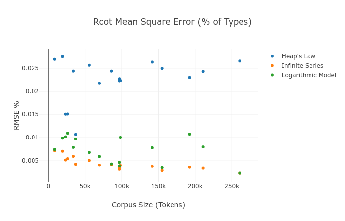

# Types, Tokens, and Hapaxes: A New Heap's Law

## Victor Davis

### Abstract

[Heap's Law](https://en.wikipedia.org/wiki/Heaps%27_law) states that in a large enough text corpus, the number of types as a function of tokens grows as $N=KM^\beta$ for some free parameters $K,\beta$. Much has been written about how this result (or variants of it) can be derived from [Zipf's Law](https://simple.wikipedia.org/wiki/Zipf%27s_law). Here we derive from first principles a completely novel expression of the type-token curve and prove its superior accuracy on real text. This expression extends quite naturally to equally accurate estimates for counting hapaxes and other $n$-legomena.

### Introduction

Zipf's Law is usually formulated as Freq $\propto$ 1/Rank, generalized by raising Rank to an exponent $\alpha$. This is benchmarked against real text and shown to be curiously accurate for corpora of varying sizes but exhibiting a "fat tail." Therefore it performs most poorly on rare words, which contribute the most to the type-token curve. The common interpretation is that any inaccuracy in a type-token growth model can be explained away by this "fat tail" in which the unpredictability of the frequency of rare words introduces noise into an otherwise correct signal. This paradigm is completely false. We show that Zipf's Law can be reformulated to model the frequencies of rare words even more accurately than common ones and that this reformulation leads to a simple, intuitive derivation of a logarithmic (*not* exponential) type-token growth curve.

### Terminology

**Tokens**: Instances of words in a text, elements of the corpus in which words are considered an ordered list. (Using "words" and "tokens" interchangeably.)

**Types**: Distinct words of a text, elements of the lexicon/vocabulary or the size of the *set* of tokens. (Using "distinct words" and "types" interchangeably.)

**Hapaxes**: Types that occur exactly once in a corpus.

**Dis, Tris, Tetrakis, Pentakis, $n$-Legomena**: Types that occur exactly $n$ times in a corpus.

**$(M,N)$-corpus**: A text corpus consisting of $M$ tokens and $N$ types.

**Optimum Sample**: A text corpus exhibiting a perfect Zipf distribution.

**Perfect Zipf Distribution**: A word frequency distribution following Zipf's law literally and perfectly, reformulated to directly estimate the number of rare words. (Defined in more detail later.)

### Hypothesis

For a text corpus consisting of $M$ tokens and $N$ types, randomly sampling $m$ tokens of that corpus yields $y$ types, and the expected value of $y\approx E(m)$ is given by [1], parametrized by $(M_z, N_z)$, the size of an optimum sample.

$$E(m) = N_z\ln\bigg(\frac{m}{M_z}\bigg)\frac{\frac{m}{M_z}}{\frac{m}{M_z}-1}$$ [1]

### Lemma: The Uniform Case

Construct a $(ks, k)$-corpus by collecting every word that occurs *exactly* $s$ times. This mini-corpus, a sub-selection of the main one, has a perfectly uniform word frequency distribution, a text consisting of $ks$ total words (tokens), $k$ distinct words (types) each repeating exactly $s$ times. What is $E_s(m)$, the expected number of types in a random selection of $m$ words out of this mini-corpus? If sampling sequentially without replacement, the expected value is the partial sum of the probability at each step of drawing a new type, so:

$$E_s(m+1) = E_s(m) + P_{new}(m+1)$$ [2]

Suppose $m$ tokens are drawn at random without replacement, resulting in $y$ types. There are then $ks-m$ tokens left to draw, $s(k-y)$ of which are types not yet drawn. Thus,

$$P_{new}(m+1) = \frac{s(k-y)}{ks-m}$$ and $$E_s(m+1) = y + \frac{s(k-y)}{ks-m}$$ [3]

Substituting the *actual* number of types drawn, $y$, for the *expected* number of types drawn, $E_s(m)$, we have a recursive expression for the growth of the curve $(m,y)$.

$$E_s(m+1) = E_s(m) + \frac{s(k-E_s(m))}{ks-m}$$ for $E_s(0) = 0$ [4]

This recursion performs quite well with real data. Consider a shuffled deck of cards, analogous to either a $(52,4)$- or $(52,13)$-corpus, depending whether suits or valors are considered "types."

We can use calculus to derive a non-recursive version of this function. Notice that since $E_s(m)$ is monotonically increasing, $$\frac{dE}{dm} \approx \frac{E_s(m+1)-E_s(m)}{m+1-m}$$. So, we can rewrite [4] and integrate:

$$dE \approx \frac{s(k - E)}{ks-m} dm \to \int \frac{dE}{k - E} \approx s\int \frac{dm}{ks-m} \to -ln(k-E) \approx -s\ln(ks-m)+C$$ 

$$E_s(m) \approx k - C'(ks-m)^s$$

Using $E_s(0)=0$ as a boundary condition, we find $$C' = \frac{k}{(ks)^s}$$, giving:

$$E_s(m) \approx k - k\bigg(1-\frac{m}{ks}\bigg)^s$$ [5]

$$Valors(m) = E_{13}(m) \approx 4 - 4\bigg(1-\frac{m}{52}\bigg)^{13}$$ [5a]

$$Suits(m) = E_4(m) \approx 13 - 13\bigg(1-\frac{m}{52}\bigg)^4$$ [5b]

Again, we find a near-perfect match between the discrete values calculated by recursing and the continuous values given by [5]. *Near* perfect because the discrete case (actual reality) effectively stopped the integral limit approaching zero once $dm=1$. Thus, [5] is in a sense "too" accurate, smoothing out the discontinuities found in a real deck of cards.

Our $(M,N)$-corpus can be partitioned into a number of $(ks,k)$-mini-corpuses, and the expected type-token curve of the whole can be gotten by summing over the individual parts. Start by partitioning the corpus into $|K|$ decks, for $K=\{(k_n, s_n)\}$, each deck $k_ns_n$ tokens consisting of $s_n$ repeats of $k_n$ types.

Now consider a fictional text, a permutation of the corpus consisting of the following: its $k_1$ hapaxes distributed uniformly throughout the text, its $k_2$ dis legomena distributed uniformly throughout the text, its $k_3$ tris legomena, etc. Repeat the construction all the way down to the commonest word (usually "the"), which is distributed uniformly throughout the text. Obviously all these words will jostle each other and land a little to the left or right of their ideal location, which is fine. For each deck we have a "stretch" factor $d_n = \frac{M}{k_ns_n}$ mapping $m$, the $m$th token *in that deck* to $m$ the $m$th word in our permuted corpus. This gives:

$$E(m) = \sum_{n=1}^{|K|} E_n(m/d_n)= \sum_{n=1}^{|K|} k_n-k_n\bigg(1-\frac{m/d_n}{k_ns_n}\bigg)^{s_n} = \sum_{n=1}^{|K|} k_n-k_n\bigg(1-\frac{m}{M}\bigg)^{s_n}$$ 

$$E(m) = N - \sum_{n=1}^{|K|} k_n\bigg(1-\frac{m}{M}\bigg)^{s_n}$$ [6]

In real text, for small values of $s$, $s_n =n$ and $k_{n+1} < k_n$. That is, there will *always* be lots of words occurring exactly once, twice, three times, etc, but it is uncertain that there will be any words occurring *exactly*, say, $123$ times. Also, more words will occur once than occur twice, more twice than three times, etc. If we take this observation as an assumption and fill in the gaps, appending to $K$ elements $(0, s)$ for all values $s \notin K$ (that is, values of $s$ for which *no* words repeat *exactly* $s$ times for large, arbitrary values of $s$), we can index $K$ on $\mathbb{N}$ and call $K$ a countably infinite, ordered, monotonically decreasing series $K=\{k_1, k_2, k_3, ...\}$, that is, the number of hapaxes, dis, tris, tetrakis, pentakis, all counts of $n$-legomena until some last non-zero value. This lets us rewrite [6] as a Taylor Series expanded about the point $(M,N)$, with the caveat that the elements of $K$ consist of real data. This Taylor Series expression, as we'll see later in the "Accuracy" section, performs nearly perfectly on real data, the main source of error being the entropy lost by permuting the corpus from noisy random data to an ordered uniform layering of decks.

$$E(m) = N - \sum_{n=1}^{\infty} k_n\bigg(1-\frac{m}{M}\bigg)^n$$ [7]

Define $k_0$ ("$0$-legomena") the number of types *not* drawn in $(m,y)$-sample such that $E(m) + k_0(m) = N$, and substitute $x=m/M$ the *proportion* of the corpus sampled rather than the raw number of tokens. Now we have a Taylor Series expanded around $(1, N)$ for $k_n(1)$--used interchangeably with $k_n$--the number of $n$-legomena in the corpus. Assuming $E$ is infinitely continuous, we find a natural connection between the counts of $n$-legomena and the derivatives of $E$.

$$E(x) = N-k_0 - \sum_{n=1}^{\infty} k_n(1-x)^n = E(1) - \sum_{n=1}^{\infty} k_n(1-x)^n$$ [8]

$$E(x) = \sum_{n=0}^\infty (-1)^nk_n(1)(x-1)^n$$ [9]

$$k_n(x) = (-1)^n\frac{x^n}{n!}E^{(n)}(x)$$ [10]

Can $k_n$ be approximated by a function of $n$? In real text, do the tabulations of $n$-legomena actually follow some regular, enumerative pattern?

### Zipf's Law

Suppose that for a given $(M,N)$-corpus there exists a corresponding optimal sample $(M_z,N_z)$-corpus following a *perfect Zipf distribution*. If the original corpus is "too big" then some number of randomly selected tokens $M_z<M$ will produce a sub-selection of text exhibiting Zipf's Law. If the original corpus is "too small" then it can be thought of as a sub-selection of some larger corpus consisting of $M_z>M$ tokens exhibiting Zipf's Law. (Of course, some corpora may be "just right" and $M_z = M$.)

Define a *perfect Zipf distribution* as follows: For some $(M_z,N_z)$-corpus with a ranked word frequency distribution $F_z=\{f_r\}$, the expected number of types repeating $n$ or more times $\pi(f_r \ge n)$ is roughly equal to $\frac{1}{n}N_z$. Alternatively, there exists about $\frac{1}{n}N_z$ types repeating $n$ or more times. "Roughly" and "about" to allow for normal statistical noise in the still "perfect" sample.

**Corollaries:**

- $k_{a<b}$ the expected number of types repeating between $a$ and $b$ times is $\pi(f_r \ge a) - \pi(f_r \ge b) = \bigg(\frac{1}{a}-\frac{1}{b}\bigg)N_z = \frac{b-a}{ab}N_z$
- The expected number of types repeating fewer than $n$ times is $\pi(f_r < n) = \frac{n-1}{n}N_z$
- No types occur exactly zero times: $k_0 = \pi(f_r < 1) = \frac{1-1}{1}N_z = 0$
- $k_n$ the expected number of types repeating *exactly* $n$ times, or the expected number of $n$-legomena (for $n>0$) equals $\pi(f_r \ge n) - \pi(f_r \ge n+1) = \bigg(\frac{1}{n}-\frac{1}{n+1}\bigg)N_z=\frac{1}{n(n+1)}N_z$
- The expected *proportions* of $n$-legomena are $\bigg\{\frac{1}{2},\frac{1}{6},\frac{1}{12},\frac{1}{20},\frac{1}{30}, ...\bigg\}$
- This distribution is already normalized: $\sum_{n=1}^\infty \frac{N_z}{n(n+1)} = N_z$
- The expected frequency of the most common word is $f_1=\frac{1}{1}N_z=N_z$
- The expected frequency of the $r$th most common word is $f_r = \bigg\lfloor\frac{N_z}{r}\bigg\rfloor$
- Freq $\propto$ 1/Rank

This reformulation of Zipf's Law is practically equivalent to the original, with the caveats that (a) for high ranks (rare words) we round *down* to the nearest integer to obtain the expected frequency, and (b) the total number of types is equal to the frequency of the commonest word. (So, curiously, there is one "the" for each vocabulary word.) This leaves us with a specific prediction for the counts of rare words ($n$-legomena for low $n$). The expected number of hapaxes, dis, tris, and higher $n$-legomena is given by:

$$k_n = \frac{N_z}{n(n+1)}$$ for $n>0, k_0 = 0$ [11]

Substituting [11] into [9] above, we can obtain an expression for the coefficients of our Taylor Series.

$$E(x) = N_z - N_z\sum_{n=1}^{\infty} (-1)^n\frac{(x-1)^n}{n(n+1)}$$ [12]

It can be shown (Appendix 2) that [12] converges on [14]. Taking successive derivatives, per [10], we now have expressions not just for the number of types with respect to tokens, but also hapaxes and higher $n$-legomena:

$$E(x) = N_z\frac{\ln(x)x}{x-1}$$ [14]

$$k_0(x) = N_z - E(x) = N_z\frac{x-\ln(x)x-1}{x-1}$$ [14.0]

$$k_1(x) = -xE'(x) = N_z\frac{x^2-\ln(x)x-x}{(x-1)^2}$$ [14.1]

$$k_2(x) = \frac{x^2}{2}E''(x) = N_z\frac{x^3-2\ln(x)x^2-x}{2(x-1)^3}$$ [14.2]

$$k_3(x) = -\frac{x^3}{6}E'''(x)= N_z\frac{2x^4+3x^3-6\ln(x)x^3-6x^2+x}{6(x-1)^4}​$$ [14.3]

$$k_4(x) =N_z\frac{3x^5+10x^4-12x^4\ln(x)-18x^3+6x^2-x}{12(x-1)^5}$$ [14.4]

$$k_5(x)=N_z\frac{12x^6+65x^5-60x^5\ln(x)-120x^4+60x^3-20x^2+3x}{60(x-1)^6}$$ [14.5]

### Accuracy

The King James Bible is a $(904514,13029)$-corpus. (Notes on methodology and all code in Appendix 1.) The most common word "the" appears $63807$ times (not $13029$), and $31.67$% of the types are hapaxes (not $50$%). It is nowhere near an optimum sample, so how do we find a suitable $(M_z, N_z)$? The proportion of hapaxes is a decreasing function, starting at $H(0)=1$, falling to $H(1)=\frac{1}{2}$, and continuing to fall as $x$ goes to infinity. We can model this by expressing [14.1] as a proportion of [14] to obtain:

$$H(x) = \frac{k_1(x)}{E(x)} = \frac{1}{\ln(x)}+\frac{1}{1-x}$$ [15]

In the limit, $H(0)=1, H(1)=\frac{1}{2}$ as expected, even though the function is undefined at those points. Using a binary search algorithm, we find that $H(11.06)=.3167$. Could this mean the Bible is "too large" a sample by a factor of $11.06$? Taking $M_z = M/11.06$ and choosing $N_z$ such that $E(M)=N$, we fit [1] to our sample corpus using optimum sample parameters $(M_z,N_z)$. Thus, we have

$$N_z = N\frac{m/M_z-1}{\ln(m/M_z)m/M_z}$$ [16]

$$E(m) = 4931\ln(m/81773)\frac{m/81773}{m/81773-1}$$ [1.1]

| tokens | types | hapax | types pred | hapax pred |
| ------ | ----- | ----- | ---------- | ---------- |
| 104    | 82    | 71    | 81         | 69         |
| 2704   | 1130  | 820   | 1119       | 832        |
| 5304   | 1863  | 1317  | 1826       | 1291       |
| 7904   | 2446  | 1651  | 2410       | 1645       |
| 10504  | 2945  | 1914  | 2918       | 1938       |
| 13104  | 3409  | 2186  | 3375       | 2190       |
| 15704  | 3734  | 2326  | 3791       | 2411       |
| 18304  | 4154  | 2523  | 4175       | 2609       |
| 20904  | 4539  | 2776  | 4534       | 2787       |
| 23504  | 4873  | 2948  | 4870       | 2951       |
| 26104  | 5189  | 3103  | 5188       | 3101       |

Beowulf is a $(26113,5189)$-corpus. The most common word "the" appears $1898$ times and $59.78$% of its types are hapaxes. Using a binary search, we find that $H(.3007) = .5978$, making Beowulf "too small," about $30$% the optimum size. Calculating $(M_z,N_z)$ as above,

$$E(m) = 10042\ln(m/86836)\frac{m/86836}{m/86836-1}$$ [1.2]

| tokens | types | hapax | types pred | hapax pred |
| ------ | ----- | ----- | ---------- | ---------- |
| 3618   | 969   | 613   | 711        | 516        |
| 94068  | 5578  | 2490  | 5284       | 2580       |
| 184518 | 7361  | 2914  | 7206       | 3120       |
| 274968 | 8508  | 3124  | 8511       | 3415       |
| 365418 | 9633  | 3534  | 9510       | 3610       |
| 455868 | 10347 | 3635  | 10325      | 3752       |
| 546318 | 11022 | 3763  | 11014      | 3860       |
| 636768 | 11640 | 3884  | 11612      | 3946       |
| 727218 | 12127 | 3954  | 12141      | 4017       |
| 817668 | 12617 | 4090  | 12615      | 4077       |
| 904514 | 13029 | 4126  | 13029      | 4126       |

Repeating the procedure, we obtain values for $(M_z,N_z)$ that estimate types, hapaxes, and higher $n$-legomena for a number of different books. We'll evaluate the model fit using root mean square error as a percent of observed types. Here are the fitting errors for real data. The Taylor Series fit from [9] using actual $n$-legomena counts as the coefficients gives a good baseline for measuring the model, since it doesn't assume Zipf's Law. Making the leap from [9] to [14] requires the assumption of the existence of an optimum sample following a perfect Zipf distribution, an assumption that appears to be more accurate in some cases, like Pride and Prejudice, and less accurate in others, like Les Miserables. Still, Heap's Law is consistently accurate to $2-3$%, while the logarithmic function derived above is nearly always accurate to within $1$%, with the exception of a few outliers.

| Book                       | $M_z$  | $N_z$ | Heaps | Taylor | Model |
| -------------------------- | ------ | ----- | ----- | ------ | ----- |
| Pride and Prejudice        | 23082  | 3109  | 2.99% | 0.50%  | 0.50% |
| A Tale of Two Cities       | 80577  | 8275  | 2.50% | 0.34%  | 0.34% |
| Wuthering Heights          | 65471  | 7794  | 2.65% | 0.37%  | 0.39% |
| Uncle Tom’s Cabin          | 85835  | 9054  | 2.56% | 0.32%  | 0.33% |
| Sons and Lovers            | 91935  | 7360  | 2.31% | 0.35%  | 0.62% |
| The Picture of Dorian Gray | 92327  | 7378  | 1.93% | 0.40%  | 0.78% |
| Republic                   | 80249  | 6817  | 2.54% | 0.29%  | 0.44% |
| Moby Dick                  | 157649 | 16150 | 2.69% | 0.25%  | 0.30% |
| The Count of Monte Cristo  | 85593  | 8181  | 2.62% | 0.28%  | 0.71% |
| Leviathan                  | 93837  | 6728  | 2.16% | 0.34%  | 1.20% |
| Don Quixote                | 131218 | 9848  | 2.43% | 0.26%  | 0.74% |
| Les Miserables             | 226250 | 15761 | 2.39% | 0.20%  | 1.11% |
| War and Peace              | 102065 | 8935  | 2.68% | 0.22%  | 0.70% |
| Beowulf                    | 86836  | 10042 | 2.17% | 0.45%  | 0.50% |
| Holy Bible                 | 81773  | 4931  | 2.31% | 0.26%  | 1.04% |
| Ulysses                    | 534001 | 41643 | 2.03% | 0.20%  | 0.36% |

Note that, as might be expected, the optimum sample sizes are far more clustered  than the observed type-token data. Removing the extreme outlier Ulysses, the best-fit sample sizes $(M_z, N_z)$ seem to cluster around $(100k, 9k)$. More data and more rigorous analysis would be needed to confirm it, but might this perhaps be the "magic number" that defines the optimum sample size of English text that best exhibits Zipf's Law?

### Conclusion

Most investigations of Zipf's Law and Heap's Law and their inter-relationship tolerate a conspicuous degree of error when applied to real text. This comes from an implicit bias that these are mere curiosities of nature, that large errors are expected when attempting to fit cogent, rational human language to a tidy physics equation. Shockingly, the discovery of the formulas above and their uncanny fit to real data imply that, far from being mere curiosities, Zipf's Law and its corresponding derivations for estimating types, hapaxes, and higher $n​$-legomena must be more fundamental to the nature of language than we give it credit. We've given no motivation for *why* Zipf's Law ought to be true for human language. Taking it (in quite a literal formulation) as an axiom, extremely accurate predictions can be made about real text, bolstering the idea that *something* fundamental must be going on, and Zipf's original observation must be the inevitable cumulative effect of some deeper, underlying information-theoretic property of human language.
